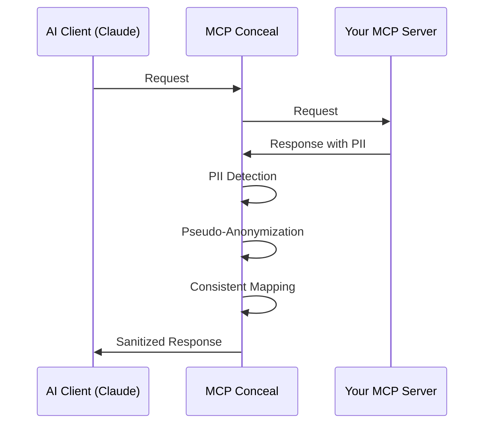

# MCP Conceal

An MCP proxy that pseudo-anonymizes PII before data reaches external AI providers like Claude, ChatGPT, or Gemini.



MCP Conceal performs pseudo-anonymization rather than redaction to preserve semantic meaning and data relationships required for AI analysis. Example: `john.smith@acme.com` becomes `mike.wilson@techcorp.com`, maintaining structure while protecting sensitive information.

## Installation

### Download Pre-built Binary

1. Visit the [Releases page](https://github.com/gbrigandi/mcp-server-conceal/releases)
2. Download the binary for your platform:

| Platform | Binary |
|----------|--------|
| Linux x64 | `mcp-server-conceal-linux-amd64` |
| macOS Intel | `mcp-server-conceal-macos-amd64` |
| macOS Apple Silicon | `mcp-server-conceal-macos-aarch64` |
| Windows x64 | `mcp-server-conceal-windows-amd64.exe` |

3. Make executable: `chmod +x mcp-server-conceal-*` (Linux/macOS)
4. Add to PATH:
   - **Linux/macOS**: `mv mcp-server-conceal-* /usr/local/bin/mcp-server-conceal`
   - **Windows**: Move to a directory in your PATH or add current directory to PATH

### Building from Source

```bash
git clone https://github.com/gbrigandi/mcp-server-conceal
cd mcp-server-conceal
cargo build --release
```

Binary location: `target/release/mcp-server-conceal`

## Quick Start

### Prerequisites

Install Ollama for LLM-based PII detection:

1. Install Ollama: [ollama.ai](https://ollama.ai)
2. Pull model: `ollama pull llama3.2:3b`
3. Verify: `curl http://localhost:11434/api/version`

### Basic Usage

Create a minimal `mcp-server-conceal.toml`:

```toml
[detection]
mode = "regex_llm"

[llm]
model = "llama3.2:3b"
endpoint = "http://localhost:11434"
```

See the [Configuration](#configuration) section for all available options.

Run as proxy:

```bash
mcp-server-conceal \
  --target-command python3 \
  --target-args "my-mcp-server.py" \
  --config mcp-server-conceal.toml
```

## Configuration

Complete configuration reference:

```toml
[detection]
mode = "regex_llm"                # Detection strategy: regex, llm, regex_llm
enabled = true                    
confidence_threshold = 0.8        # Detection confidence threshold (0.0-1.0)

[detection.patterns]
email = "\\b[A-Za-z0-9._%+-]+@[A-Za-z0-9.-]+\\.[A-Z|a-z]{2,}\\b"
phone = "\\b(?:\\+?1[-\\.\\s]?)?(?:\\(?[0-9]{3}\\)?[-\\.\\s]?)?[0-9]{3}[-\\.\\s]?[0-9]{4}\\b"
ssn = "\\b\\d{3}-\\d{2}-\\d{4}\\b"
credit_card = "\\b\\d{4}[-\\s]?\\d{4}[-\\s]?\\d{4}[-\\s]?\\d{4}\\b"
ip_address = "\\b(?:(?:25[0-5]|2[0-4][0-9]|[01]?[0-9][0-9]?)\\.){3}(?:25[0-5]|2[0-4][0-9]|[01]?[0-9][0-9]?)\\b"
url = "https?://[^\\s/$.?#].[^\\s]*"

[faker]
locale = "en_US"                  # Locale for generating realistic fake PII data
seed = 12345                      # Seed ensures consistent anonymization across restarts
consistency = true                # Same real PII always maps to same fake data

[mapping]
database_path = "mappings.db"     # SQLite database storing real-to-fake mappings
retention_days = 90               # Delete old mappings after N days

[llm]
model = "llama3.2:3b"             # Ollama model for PII detection
endpoint = "http://localhost:11434"
timeout_seconds = 180
prompt_template = "default"       # Template for PII detection prompts

[llm_cache]
enabled = true                    # Cache LLM detection results for performance
database_path = "llm_cache.db"
max_text_length = 2000
```

### Configuration Guidance

**Detection Settings:**
- `confidence_threshold`: Lower values (0.6) catch more PII but increase false positives. Higher values (0.9) are more precise but may miss some PII.
- `mode`: Choose based on your latency vs accuracy requirements (see Detection Modes below)

**Faker Settings:**
- `locale`: Use "en_US" for American names/addresses, "en_GB" for British, etc. Affects realism of generated fake data
- `seed`: Keep consistent across deployments to ensure same real data maps to same fake data
- `consistency`: Always leave `true` to maintain data relationships

**Mapping Settings:**
- `retention_days`: Balance between data consistency and storage. Shorter periods (30 days) reduce storage but may cause inconsistent anonymization for recurring data
- `database_path`: Use absolute paths in production to avoid database location issues

## Detection Modes

Choose the detection strategy based on your performance requirements and data complexity:

### RegexLlm (Default)
**Best for production environments** - Combines speed and accuracy:
- Phase 1: Fast regex catches common patterns (emails, phones, SSNs)
- Phase 2: LLM analyzes remaining text for complex PII
- **Use when**: You need comprehensive detection with reasonable performance
- **Performance**: ~100-500ms per request depending on text size
- Configure: `mode = "regex_llm"`

### Regex Only
**Best for high-volume, latency-sensitive applications**:
- Uses only pattern matching - no AI analysis
- **Use when**: You have well-defined PII patterns and need <10ms response
- **Trade-off**: May miss contextual PII like "my account number is ABC123"
- Configure: `mode = "regex"`

### LLM Only  
**Best for complex, unstructured data**:
- AI-powered detection catches nuanced PII patterns
- **Use when**: Accuracy is more important than speed
- **Performance**: ~200-1000ms per request
- Configure: `mode = "llm"`


## Advanced Usage

### Claude Desktop Integration

Configure Claude Desktop to proxy MCP servers:

```json
{
  "mcpServers": {
    "database": {
      "command": "mcp-server-conceal",
      "args": [
        "--target-command", "python3",
        "--target-args", "database-server.py --host localhost",
        "--config", "/path/to/mcp-server-conceal.toml"
      ],
      "env": {
        "DATABASE_URL": "postgresql://localhost/mydb"
      }
    }
  }
}
```

### Custom LLM Prompts

Customize detection prompts for specific domains:

**Template locations:**
- Linux: `~/.local/share/mcp-server-conceal/prompts/`
- macOS: `~/Library/Application Support/com.mcp-server-conceal.mcp-server-conceal/prompts/`
- Windows: `%LOCALAPPDATA%\\com\\mcp-server-conceal\\mcp-server-conceal\\data\\prompts\\`

**Usage:**
1. Run MCP Conceal once to auto-generate `default.md` in the prompts directory:
   ```bash
   mcp-server-conceal --target-command echo --target-args "test" --config mcp-server-conceal.toml
   ```
2. Copy: `cp default.md healthcare.md`  
3. Edit template for domain-specific PII patterns
4. Configure: `prompt_template = "healthcare"`

### Environment Variables

Pass environment variables to target process:

```bash
mcp-server-conceal \
  --target-command node \
  --target-args "server.js" \
  --target-cwd "/path/to/server" \
  --target-env "DATABASE_URL=postgresql://localhost/mydb" \
  --target-env "API_KEY=secret123" \
  --config mcp-server-conceal.toml
```

## Troubleshooting

Enable debug logging:

```bash
RUST_LOG=debug mcp-server-conceal \
  --target-command python3 \
  --target-args server.py \
  --config mcp-server-conceal.toml
```

**Common Issues:**
- Invalid regex patterns in configuration
- Ollama connectivity problems
- Database file permissions
- Missing prompt templates

## Security

**Mapping Database:** Contains sensitive real-to-fake mappings. Secure with appropriate file permissions.

**LLM Integration:** Run Ollama on trusted infrastructure when using LLM-based detection modes.

## Contributing

Contributions are welcome! Follow these steps to get started:

### Development Setup

**Prerequisites:**
- Install Rust: https://rustup.rs/
- Minimum supported Rust version: 1.70+

1. **Clone and setup:**
   ```bash
   git clone https://github.com/gbrigandi/mcp-server-conceal
   cd mcp-server-conceal
   ```

2. **Build in development mode:**
   ```bash
   cargo build
   cargo test
   ```

3. **Install development tools:**
   ```bash
   rustup component add clippy rustfmt
   ```

4. **Run with debug logging:**
   ```bash
   RUST_LOG=debug cargo run -- --target-command cat --target-args test.txt --config mcp-server-conceal.toml
   ```

### Testing

- **Unit tests:** `cargo test`
- **Integration tests:** `cargo test --test integration_test`
- **Linting:** `cargo clippy`
- **Formatting:** `cargo fmt`

### Submitting Changes

1. Fork the repository
2. Create a feature branch: `git checkout -b feature-name`
3. Make your changes and add tests
4. Ensure all tests pass: `cargo test`
5. Format code: `cargo fmt`
6. Submit a pull request with a clear description

## License

MIT License - see LICENSE file for details.